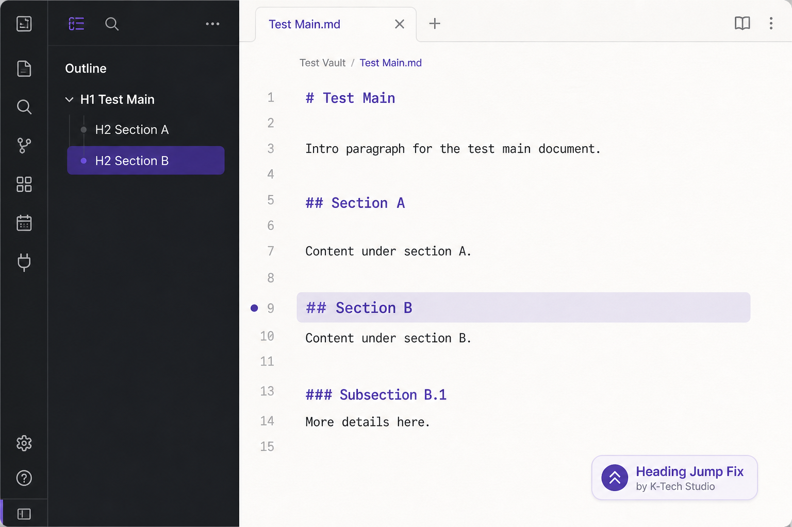

# Heading Jump Fix

[](https://github.com/crossbeat461-a11y/k-tech-heading-jump-fix/releases/latest)
[](LICENSE)
[](https://github.com/crossbeat461-a11y/k-tech-heading-jump-fix/actions/workflows/release.yml)

[](https://buymeacoffee.com/k_tech_studio)

**[English](#readme-en)** · **[日本語](#readme-ja)**



K-Tech Studio plugin that **auto-corrects scroll position** after you click a heading in the Outline sidebar.

---

<a id="readme-en"></a>

## English

### Problem

In Live Preview, clicking a heading in the Outline sometimes moves the cursor but **does not scroll** the editor to show that heading — especially on long notes or right after opening the app (lazy rendering). Many users click twice; this plugin performs that second correction automatically.

### What it fixes

- Outline sidebar: one click should scroll to the heading
- Duplicate headings: disambiguated by order in the outline
- Configurable retry delay and retry count

### What it does not fix

- General UI sluggishness (Electron/GPU, too many plugins)
- Dropbox or sync I/O delay
- In-note `[[wikilink#heading]]` clicks (planned Phase 2)
- Reading view–only navigation

### How to use

1. Install manually: copy `main.js`, `manifest.json`, `styles.css` to  
   `YourVault/.obsidian/plugins/k-tech-heading-jump-fix/`
2. Enable **Heading Jump Fix** under Community plugins
3. Open a long note, use the core **Outline** pane, click any heading once

**Settings** (plugin options):

| Setting | Default | Description |
|---------|---------|-------------|
| Enable plugin | ON | Master switch |
| Outline click fix | ON | Retry scroll after outline clicks |
| Retry delay (ms) | 250 | Wait before correction |
| Retry count | 1 | Extra scroll passes |

**Command palette:** `Jump to heading at cursor line reliably` — scrolls to the heading that contains the current cursor line.

### Development

```bash
npm install
npm run build
```

See [HANDOFF.md](./HANDOFF.md) for architecture and Phase 2 plans.

### Author

K-Tech Studio — [Buy Me a Coffee](https://buymeacoffee.com/k_tech_studio)

### License

MIT

---

<a id="readme-ja"></a>

<details open>
<summary><strong>日本語</strong></summary>

Live Preview でアウトラインの見出しをクリックしても、カーソルだけ動いて **スクロールが追従しない** ことがあります（長文・起動直後など）。2 回目のクリック相当をプラグインが自動で行います。

### 直すもの

- アウトライン 1 クリックでの見出しジャンプ
- 同名見出し（アウトライン上の順序で区別）
- リトライ遅延・回数の設定

### 直さないもの

- 全体の UI ラグ
- Dropbox 同期遅延
- 本文内 wikilink クリック（Phase 2 予定）

### 使い方

1. `YourVault/.obsidian/plugins/k-tech-heading-jump-fix/` に3ファイルを配置
2. コミュニティプラグインで有効化
3. 長いノートでアウトラインから見出しを1回クリック

テスト用ノート: [test/fixtures/long-note.md](./test/fixtures/long-note.md) を Vault にコピーして使用。

</details>
